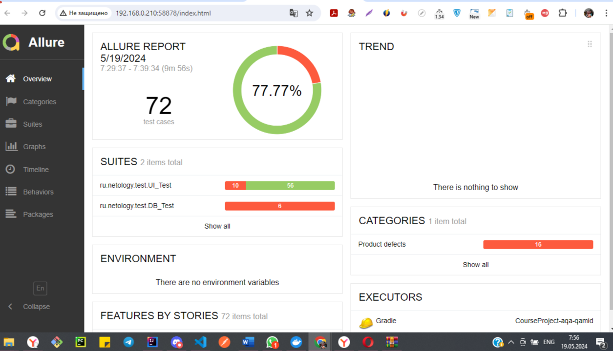
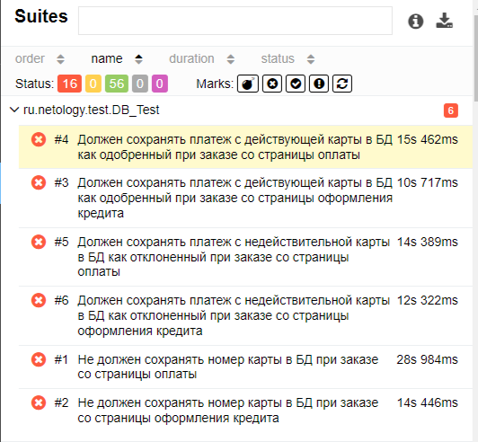
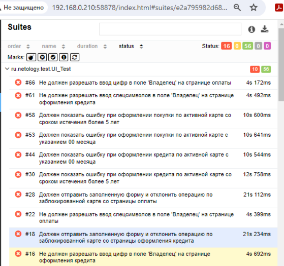

## Отчет о проведенном тестировании web-сервиса покупки туристического тура
В ходе настоящего тестирования был проверен функционал сервиса покупки туристического тура посредством прямой оплаты и оформлением кредита по данным банковской карты. Проверки включали тестирование пользовательского интерфейса, а также автотесты - использовалась одна из поддерживаемых приложением баз  данных (MySQL)  
В процессе тестирования было воспроизведено 72 тест-кейса, включающих позитивные и негативные сценарии использования тестируемого приложения.

Из 72 тест-кейсов 56 пройдены успешно (77,77% от общего количества), 16 завершились с ошибкой.

Баг-репорты с описанием выявленных дефектов оформлены в разделе [issues](https://github.com/Lgvju/CourseProject-aqa-qamid/issues) 

Подробный отчет при подключении к  [MySQL](https://github.com/Lgvju/CourseProject-aqa-qamid/blob/main/test-documentation)

## Общие рекомендации:
1. Прописать более подробные подсказки при валидации полей. Не всегда понятно, какой формат ввода валиден
2. Установить для поля "Владелец" параметр максимальной длины. Отсутствие данного ограничения является потенциальной уязвимостью для баз данных
3. В настоящий момент не всегда понятно, на какой вкладке находится пользователь- страница  покупки и оформления кредита. (Необходимо лучшить визуализацию переключения между страницами например, изменением цвета  кнопок при нажатии)
4. Для поля "Стоимость тура" прописать data-test-id CSS-селектор. В текущей итерации приложения авто-тесты, сопоставляющие стоимость тура на странице со стоимостью, внесенной требуют ежедневной актуализации

 

  